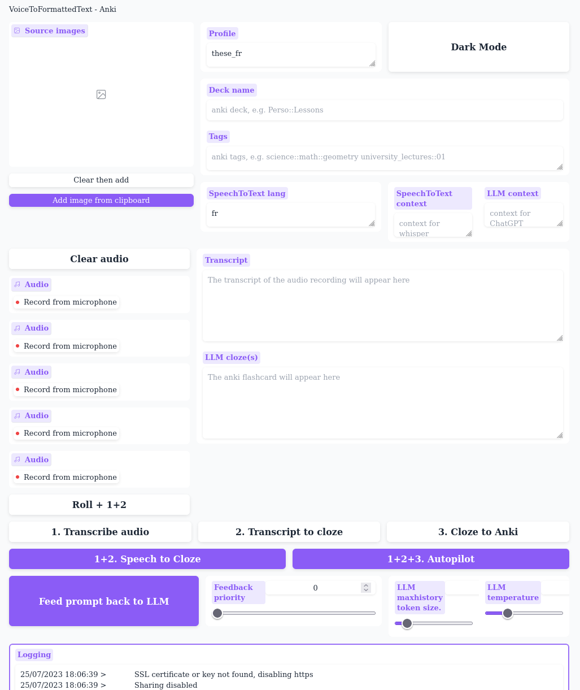
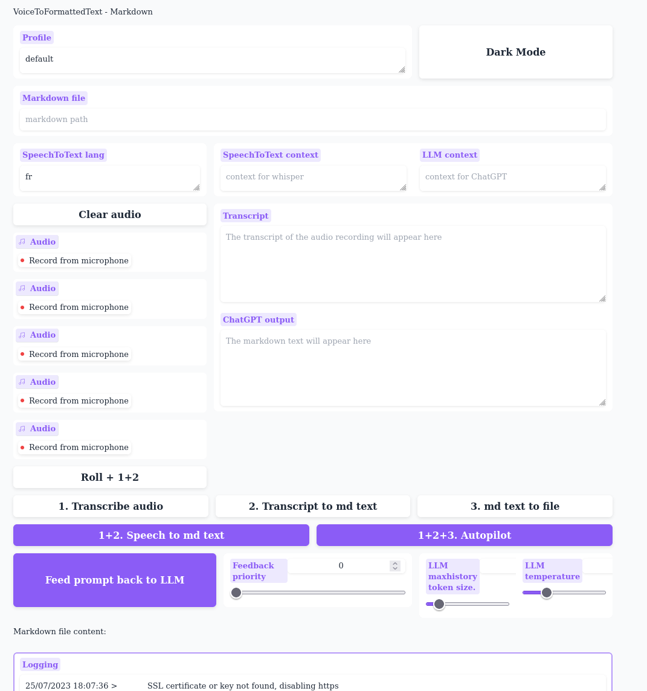

# VoiceToFormattedText

## What is this?
* VoiceToFormattedText is a tool that leverages the power of ChatGPT to correct the transcription of Whisper to output useful content. Currently supported output backends are "markdown" to append your text to a .md file, and "anki" to create anki cards automatically.
* Use case so far include writing a physics PhD in markdown with LaTeX formulae created on the go and creating anki cloze cards with specific formattings with minimal user interaction.

### Features
* You can specify the context to whisper and to ChatGPT to reduce transcription mistake.
* With the click of a button you can save a completion to serve as an example to ChatGPT's next completion.
  * you can specify the importance of each supplied example then let an algorithm fill as much as the context window as you want.
* For the anki backend, you can create multiple flashcard with a single voice recording that will include images and tags and straight to the right deck.
  * Images supplied this way will be OCR'ed using a special DIY formatting algorithm to maintain the text formatting of the image.

## Getting started
* clone this repo
* Install the dependencies: `python -m pip install -r requirements.txt`
* For the anki backend: Anki must be open and with addon [AnkiConnect](https://ankiweb.net/shared/info/2055492159) enabled.
* `python VoiceToFormattedText.py --browser`
    * `--backend=anki OR markdown`
    * `--open_browser` opens the browser on the interface.
    * `--authentication` enables the authentication panel. user/password have to be edited in `VoiceToFormattedText.py`.
    * `--localnetwork` to make the interface accessible to your local network. Use `ifconfig` to figure out your local IP adress and connect to it using `https://[IP]:7860` (don't forget the http**s** ). You can use that to make it accessible from the global internet if you configure port forwarding from your router. Otherwise it's only accessible from the computer.
    * `--debug` to increase verbosity.
    * **CAREFUL** if you add `--share`, the interface will be forwarded to Hugging Face's website and accessible via a URL for 72 hours. Handy if you want to use WhisperToAnki on mobile but can have privacy and security implications.
* open your browser at the URL shown in the output.
* The first thing to do is to enter a profile name in the `profile` field. This will automatically fill the other fields with the latest value. Then also go enter the API key.

## Notes
* If using SSL, the certificates will probably be self signed, you'll likely have to tick a few checkbox on your browser to access the site.
* It's apparently way less CPU intensive to use Chromium than to use firefox according to my limited testing with a heavily modified firefox.
* For now running the script creates temporary .wav files that are deleted at each startup automatically. This will be fixed eventually.
* tips for anki: if you want to quickly have high quality card, add the end of the recording mention notes to alfred like "Note à Alfred: fait 3 cartes sur cette notion" or "Note à Alfred: fait une carte de liste". Then simply manually delete from the transcript that you guided Alfred and save the prompt as a good example of Alfred doing what you wanted.
* The memories prompts are stored in your profile folder.
* To update the app, you just have to do `git pull`
* Reach out if you have any issue.
* Feedbacks (of any nature) are much appreciated.

## Gallery
* Anki backend:
  * 
* Markdown backend:
  * 
