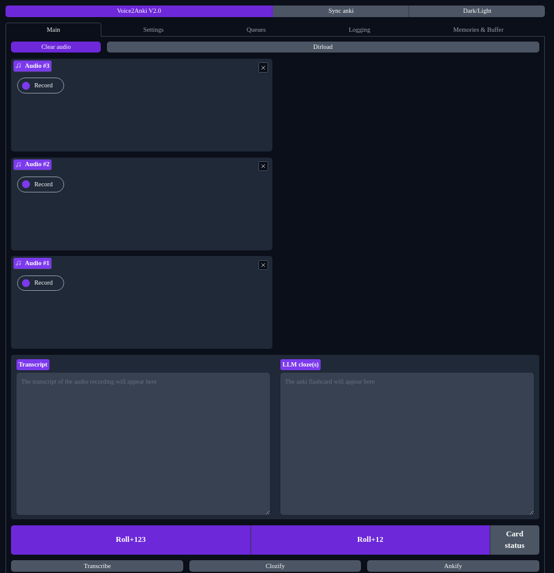
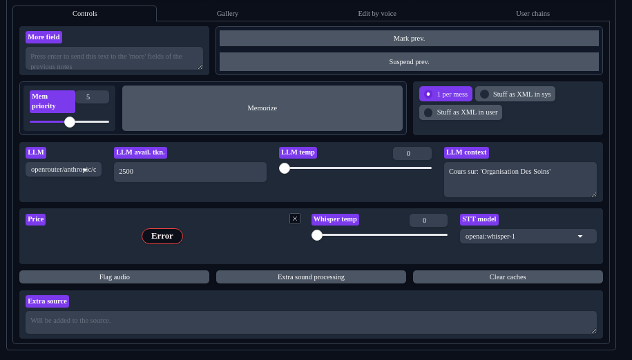
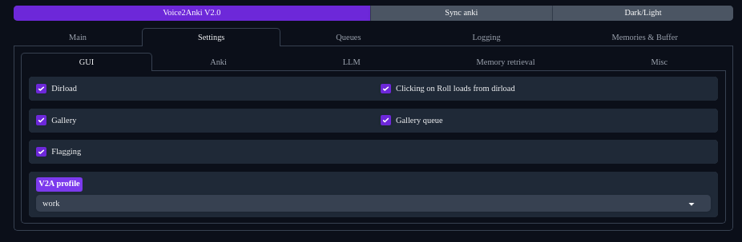
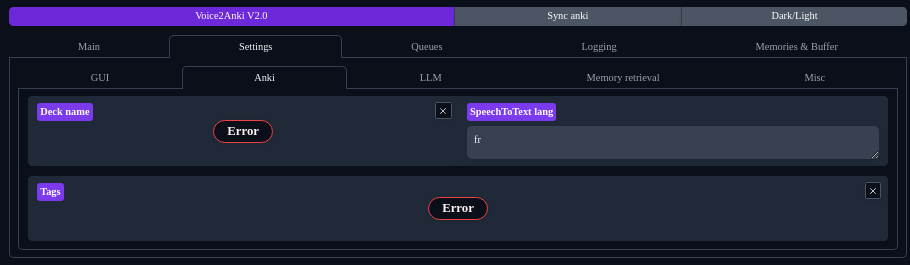
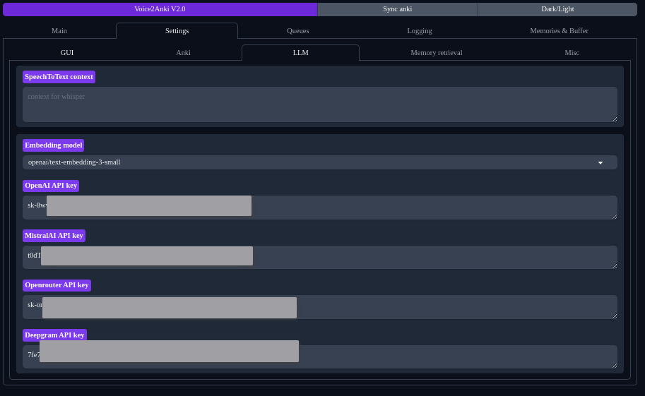
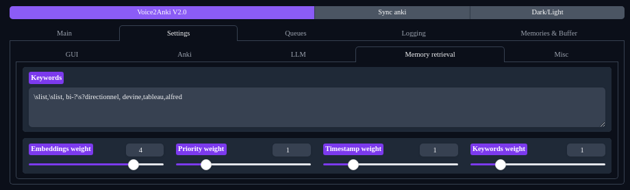
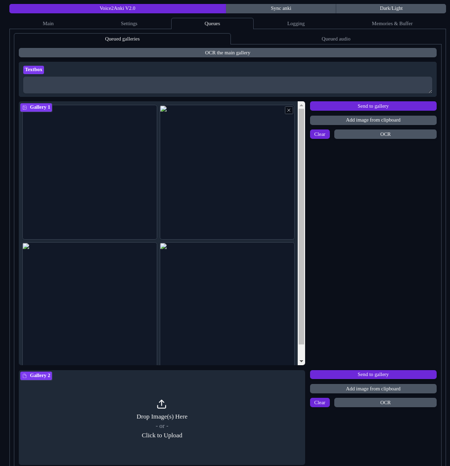

# Voice2Anki

## What is Voice2Anki?
* Voice2Anki is a tool that leverages the power of LLMs (think ChatGPT) to correct the transcription of TTS (text to speech, think openai's whisper) models to create [Anki](https://apps.ankiweb.net/) flashcards. It allows to create many very **high quality** flashcards at a **fast speed**, on **any subjects**, using **any language**, **using the same phrasing you would use** (thanks to Few Shot Learning it learns through the passed examples). I have many other Anki projects, so don't hesitate to check them out!

### Key Features
* **Universal Language Support**: Works seamlessly in any language
* **Topic Flexibility**: Handles any subject matter with efficient LLM-powered Whisper corrections
* **Adaptive Learning** (Few-Shot Learning): 
    * **Smart Adaptation**: The system learns from your corrections (voice or manual)
    * **Memory System**: Uses embeddings and keywords to find relevant examples for future cards
* **Powerful Customization**:
    * **Multiple LLMs**: Supports ChatGPT, GPT-4, replicate models, and openrouter models via [litellm](https://docs.litellm.ai/)
    * **TTS Options**: Multiple Text-to-Speech models available
    * **Advanced Functions**: Add custom Python functions for specialized card formatting
    * **LangChain Integration**: Supports custom formatting (e.g., table data conversion)
* **Rich Anki Integration**:
    * Specify tags, marks, and deck organization
    * **Smart OCR**: Automatically processes images while preserving formatting
* **Profile System**: Create and manage multiple profiles for different use cases

## Getting Started

### Prerequisites
* Python 3.11 or later (required for asyncio.timeout)
* Anki with [AnkiConnect](https://ankiweb.net/shared/info/2055492159) addon installed and enabled
* An OpenAI API key or compatible LLM service

### Quick Installation
1. Clone the repository:
   ```bash
   git clone https://github.com/thiswillbeyourgithub/Voice2Anki.git
   cd Voice2Anki
   ```
2. Install dependencies:
   ```bash
   python -m pip install -r requirements.txt
   ```

### Running Voice2Anki
1. Start Anki and ensure AnkiConnect is enabled
2. Launch Voice2Anki:
   ```bash
   python Voice2Anki.py
   ```
   
### Key Launch Options
* `--open_browser`: Automatically opens your default browser
* `--authentication`: Enables secure login (edit credentials in Voice2Anki.py)
* `--localnetwork`: Makes interface available on your local network via `https://[LOCAL_IP]:7860`
* `--debug`: Increases logging verbosity for troubleshooting
* `--share`: Creates a temporary public URL (72h) via Hugging Face (**use with caution**)

View all options with:
```bash
python Voice2Anki.py --help
```

### First-Time Setup
1. Open your browser to the URL shown in the console output
2. Enter a profile name in the `profile` field (this loads default settings)
3. Configure your API key in the settings

## Important Notes

### Security & Performance
* **SSL Certificates**: Self-signed certificates require browser security exceptions
* **Browser Compatibility**: Chromium-based browsers show better CPU performance than Firefox
* **Updates**: Simply run `git pull` to get the latest version

### Tips & Tricks
* **Quick Quality Cards**: Add hints to Alfred at the end of recordings:
  * Example: "Note to Alfred: do 3 cards on that topic"
  * Example: "Note to Alfred: a list card"
* **Memory Storage**: Prompt memories are saved in your profile folder
* **Workflow**: After Alfred creates cards, remove the hint from the transcript and save it as a good example

### Support
* Feel free to reach out with any issues
* All feedback is welcome and helps improve the project


## Gallery
* Interface screenshots:
  * 
  * 
  * 
  * 
  * 
  * 
  * 

  # Roadmap
<i>This TODO list is maintained automatically by [MdXLogseqTODOSync](https://github.com/thiswillbeyourgithub/MdXLogseqTODOSync)</i>

  <!-- BEGIN_TODO -->
- ### Urgent
- add a tab with the documentation inside
    - starts from the problem
- switch to gradio 5
    - https://github.com/gradio-app/gradio/issues/9463
- make easy to install via pypi / stop using requirements
- Make the `utils/cli.py` version a first class citizen
- ### Enhancements
- by default create a Voice2Anki deck inside anki if needed
- create a project icon
- display the total price in the settings
- API should be set as a textbox that works for all APIs instead of a dedicated field each time
- use the litellm tokenizer as it's a bit better than relying only on openai
- the system prompt should contain a string like {EXTRA_RULES} so that the user can add its own rules
- add  a setting for a list of tags that you can add with a quick button to the previous card
- use pandas to handle the embeddings instead of lists. This probably makes the score computation non scalable.
- in the prompt make the LLM use a <thinking> xml tag
- make it easier to change the endpoint url for whisper
- checkbox to disable OCR + to set the OCR language
- for each prompt used, keep a counter of how many times it is used, and a counter of how many times it is used on the same audio inputs
    - as if it's used say 10 times on the same prompt, that means it was not sufficient and might be a bad example
- replace most hardcoded strings by variables in a py file
- store the thoughts in the memories maybe?
- ### Overhaul
- use faiss (possibly langchain) to handle the embeddings as it currently might not be scalable.
- change the way audo components are used
    - create like 1000 components
- convert more of the code to use async
- add a column to add buttons to easily add a text to the prompt or the audio. This way, modifications that the user frequently has to do are quicker to do.
<!-- END_TODO -->


## FAQ

<details>
  <summary>
    Click to show
  </summary>


#### Why was this project created?
      Voice2Anki started as a tool to help me towards the end of medical school. I then released it hastily here and documented it quickly using [aider](https://aider.chat/). It worked well for me and I think it should be made much more accessible to people.

#### How did you use it?
      My workflow was to **record long audio sessions** where I would speak out loud the flashcards I wanted to create, separating each card with an audible "STOP". Using my other project [Whisper Audio Splitter](https://github.com/thiswillbeyourgithub/whisper_audio_splitter), I could then **automatically split** this long recording into individual flashcard-sized segments. These segments were then **batch processed** by Voice2Anki which would create and import them directly into Anki. This approach was **very efficient** for creating large numbers of high-quality flashcards quickly.

#### What is the status of this project?
      I will now use it much less because I'm nearing the end of medical school but definitely want this project to grow. If people are knowledgeable about python packaging into anki don't hesitate to come forward because I won't have the time alone and if no one seems interested. Last time I checked it was fully functional but I modified it to make it more accessible and documented etc and some bugs might have appeared because of the refactoring so please don't hesitate to open an issue as it's usually something dumb and quick to fix. Check out the Roadmap section above for a comprehensive list of planned improvements and known issues that need to be addressed.

#### What are profiles and why should I use them?
      Profiles were made to separate example prompts. For example, if you have lots of list type anki cards about medical stuff then you might want a separate folder for physics related flashcards where your cards are phrased in another way.

#### What does OCR have to do with Voice2Anki?
      I made https://github.com/thiswillbeyourgithub/OCR_with_format to do OCR on the screenshots I was taking from my medical books so decided to include it in Voice2Anki so that you can use the native anki search browser and it will search among image content too.

#### What is Few-Shot Learning?
      Few-Shot Learning is a machine learning approach where a model learns from a very small number of examples, unlike traditional machine learning that requires large datasets. In Voice2Anki, this technique is used to adapt the LLM's behavior based on just a few corrected examples you provide. When you correct a card and save it as an example, the system uses these few examples (or "shots") to understand your preferred style and formatting, making future cards more aligned with your preferences. You can learn more about Few-Shot Learning [here](https://www.geeksforgeeks.org/zero-shot-vs-one-shot-vs-few-shot-learning/#what-is-fewshot-learning).

#### Do I have to use the Gradio GUI or can it run autonomously?
      Initially, Voice2Anki was designed to be used only with the GUI interface. However, there is now an experimental CLI script located at `utils/cli.py` that can create flashcards autonomously. Please note that this CLI version is personal, barely tested, and should be used with caution.

#### How can I help with the project?
      We need help in several areas, including making the CLI version a first-class citizen of the project, improving documentation, and making the installation process easier through PyPI. If you're knowledgeable about Python packaging for Anki, we'd especially appreciate your expertise.


</details>
